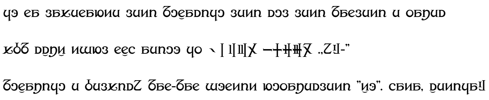

# gy1 bet2 pmcp font【層圧島集倉字】



pbm csxz tdnl kgh aeiuo 01234 56789 .,?!-"  
mugaxiju e belpic? mak-mak doktit nuwaxecleti "zo". hata, setija!


## ビルド方法

```shell
npm install
npx tsc
node to_font.js
```

## ファイル構成

main.svg は下書き。本編画像は glyphs/ フォルダ。
